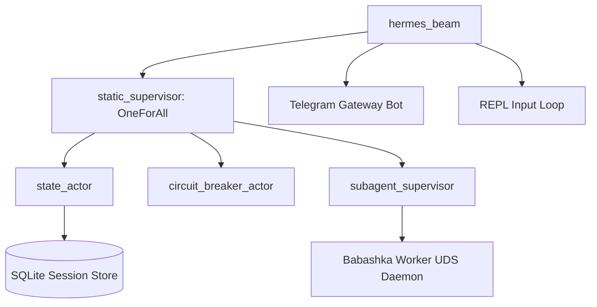

# Hermes BEAM ☤

**The highly concurrent, fault-tolerant, and stateful AI agent ecosystem built on Erlang/OTP, written in Gleam.**

Hermes BEAM is a pure Gleam port of the reference `hermes-agent` implementation. By leveraging the Erlang Virtual Machine (BEAM) and the Open Telecom Platform (OTP), it decomplectates runtime orchestration, platform gatekeepings, and sandbox executions into clean failure domains managed by supervised actors.

---

## 🚀 Key Features

*   **Erlang/OTP Actor Concurrency**: Dynamic supervision trees (`static_supervisor`), circuit breakers (`circuit_breaker_actor`), token budgets, and mailboxes ensure 100% thread safety and isolated failure containment.
*   **Native GleamDB Memory Stack**: Uses a local, Clojure-backed Datalog database (via out-of-process Babashka workers). Custom relational facts are transacted as `[Entity, Attribute, Value]` Datoms.
*   **Dialectic Contradiction Detection**: Runs deterministic inequality query constraints (`[[!= ?v1 ?v2]]`) in local Datalog to flag conflicting user preferences (e.g. VS Code vs. Emacs preference) instantly for agent-guided reconciliation.
*   **Local Semantic Cross-Session Search**: Generates session context summaries, runs cosine similarity calculations in pure Gleam, and queries nearest-neighbor session embeddings from a local SQLite database.
*   **Stateful Cron Scheduler Actor**: Features a pure 5-field cron parser (`*/15`, `1-5`, `0,7`) with minute-resolution Unix-epoch check limits to prevent double triggering, spawning conversations in background processes to keep the tick loop non-blocking.
*   **Autonomous Curation Hook**: Hooked directly into the REPL session exit. On `/quit` or `/exit`, the curator analyzes the chronological session transcript and compiles reusable patterns into standard `SKILL.md` files.

---

## 🛠 Architecture & Supervision



*   **State Isolation**: The SQLite session database is managed by a single state actor, eliminating write contention.
*   **Process Boundaries**: Network I/O (LLM completion calls) and terminal commands are executed under monitored, asynchronous `taskle` processes to guarantee safety boundaries and recover from crashes.

---

## 📦 Installation & Setup

### Prerequisites

Ensure you have the following installed on your system:
*   [Gleam](https://gleam.run/) (v1.2+)
*   [Erlang/OTP](https://www.erlang.org/) (v26+)
*   [Babashka](https://babashka.org/) (for out-of-process Datalog queries)

### 1. Clone & Build

```bash
git clone https://github.com/criticalinsight/hermes-beam-port.git
cd hermes-beam-port/hermes_beam
gleam build
```

### 2. Environment Variables

Create a `.env` file in the root of your home directory (`~/.hermes/.env`) or configure these in your shell environment:

```env
HERMES_API_KEY="your-llm-api-key"
HERMES_BASE_URL="https://api.openai.com/v1" # Or OpenRouter, Portal, etc.
HERMES_MODEL="meta-llama/llama-3-8b-instruct:free"
HERMES_TELEGRAM_TOKEN="your-telegram-bot-token"
```

---

## 🎮 Usage

### Start Interactive REPL

Runs the pure command-line console loop. Command autocomplete is automatically wired to the Erlang shell.

```bash
gleam run
```

### Start Telegram Gateway

Boots the supervised Telegram updates poller. Message queues are handled sequentially per chat ID.

```bash
gleam run --telegram
```

### Run Tests

Runs the full test suite verifying cron ticks, Datalog queries, vector similarity, and skill synthesis:

```bash
gleam test
```

---

## 📚 Interactive REPL Commands

*   `/quit` or `/exit` — Cleanly terminates REPL, curating the session transcript to synthesize new skills.
*   `/help` — Prints the command listing.
*   `/clear` — Wipes the current in-memory conversation history.
*   `/sessions` — Lists the 10 most recent sessions stored in the SQLite DB.
*   `/resume <session_id>` — Resumes a session, loading history and current working directory.
*   `/rollback <N>` — Rolls back the active session history by `N` turns.
*   `/search <query>` — Runs SQLite FTS5 search across historical transcripts.
*   `/goal <prompt>` — Enters Goal Mode (background worker execution).
*   `/cwd <path>` — Updates the active session's terminal working directory.
*   `/run <command>` — Runs a shell command locally (under macOS sandbox constraints if enabled).

---

## 📄 License

MIT License. See `LICENSE` for details.
