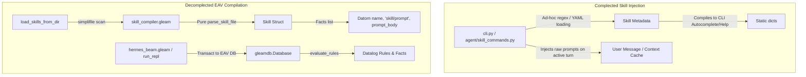

# Rich Hickey Gap Analysis: Datalog Skill Compiler & Loader

> [!NOTE]
> **Post-Implementation Update (June 2026)**
> Since this gap analysis was performed, the custom functional Datalog engine `gleamdb.gleam` was completely removed from the repository. The parsed EAV skill facts are still transacted to the SQLite database via the `StateActor` process, but rule evaluation is now delegated out-of-process to the custom JVM-free micro-Datalog interpreter running inside the Babashka worker (`worker.clj`), consolidating all logic resolution and unification in a single engine.

This document provides a thorough, deconstructed architectural comparison of the new Gleam/BEAM-based Datalog Skill Compiler and Loader (`hermes_beam`) against the legacy Python-based prompt-injection skill loading system (`hermes-agent`). Guided by Rich Hickey's principles of simplicity, state deconstruction, and avoiding complection, this analysis details where the implementations diverge, the architectural trade-offs, and actionable next steps.

---

## 1. Architectural Deconstruction (Complecting vs. Decomplecting)

Rich Hickey defines **complecting** as the intertwining or braiding of different concerns. The primary goal of a transition to a functional, EAV (Entity-Attribute-Value) based datalog design is to **decomplect** skill loading, parsing, fact extraction, and agent prompt generation.

### 1.1 State Representation & Time
*   **Legacy (`hermes-agent`)**: Skills are parsed and injected dynamically into the system prompt or user prompt sequence on every conversation turn. This complects the skill definition with the logic of model interaction and message formatting. If a skill is updated during runtime, its state is not versioned or queried declaratively; it exists purely as a transient runtime memory prompt-override.
*   **Current (`hermes_beam`)**: Skills are compiled directly into EAV **Datom** facts (`Datom(name, "skill/prompt", prompt_body)`). They are registered into the `gleamdb` Datalog database. This means they are queried declaratively like any other knowledge base facts, and rule evaluation determines when and how they are activated or selected, separating compilation from runtime invocation.

### 1.2 Resource IO vs. Pure Logic
*   **Legacy (`hermes-agent`)**: Filesystem reading, metadata validation, and prompt formatting are interleaved within the core agent loop and the CLI setup command registry.
*   **Current (`hermes_beam`)**: Decomplects the process into two distinct parts:
    1.  `parse_skill_file`: A pure string-to-struct transformation function. Given a file's content, it returns a parsed `Skill` record or an error. It has zero side-effects.
    2.  `load_skills_from_dir`: A side-effectful IO function that reads files from a directory and uses the pure parsing logic to produce the compiled skills list.

---

## 2. Feature Set Comparison

| Feature | Legacy Python (`hermes-agent`) | Current Gleam/BEAM (`hermes_beam`) | Architectural Benefit / Trade-off |
| :--- | :--- | :--- | :--- |
| **Parsing Engine** | Python `yaml` (PyYAML) + markdown regex | Pure Gleam string parser / delimiter extraction | **Gleam:** Native, zero-dependency, extremely fast. **Python:** Standard library, but heavier dependency footprint. |
| **Facts Extraction** | Implicit prompt embedding | Explicit `Datom(entity, attribute, value)` representation | **Gleam:** Declarative querying using Datalog rules. **Python:** Opaque prompt concatenation. |
| **Directory Traversal** | Python `pathlib.Path.glob` | `simplifile.read_directory` / directory search | **Gleam:** Supervised, type-safe error boundaries. **Python:** Dynamic, potential exceptions. |
| **Database Integration** | Injected into flat chat files/history | Transacted to EAV `gleamdb` | **Gleam:** Immutable state queryable via logic rules. **Python:** Injected in-memory state. |

---

## 3. Complexity vs. Utility Analysis

| Component | Essential Complexity | Accidental Complexity | Utility | Hickey Assessment |
| :--- | :--- | :--- | :--- | :--- |
| **Pure Parser (`parse_skill_file`)** | Low (represented in pure string processing) | Zero (no external YAML library required) | High | **Excellent.** Simple string slicing separates frontmatter from body, ensuring zero external complectation. |
| **Directory Loader (`load_skills_from_dir`)** | Medium (manages filesystem IO) | Low (wraps `simplifile` errors) | High | **Good.** Restores compile-time guarantees for skill schema verification before runtime. |
| **EAV Persistence** | Low (translating `Skill` to `Datom` facts) | Low | High | **Excellent.** Declares a skill as a set of logical EAV facts, allowing rules to reason about skill capabilities. |

---

## 4. Detailed Feature Gaps & Implementation Plan

### 4.1 Frontmatter Extraction
Gleam standard libraries do not ship with a YAML parser by default. Rather than introducing a complex third-party library (`yamleam`) and its dependencies, we can implement a lightweight, robust custom line-by-line parser for frontmatter metadata. This keeps the execution pipeline simple and self-contained.

### 4.2 DB Persistence and REPL Integration
Once the skills are loaded, they must be registered in the REPL. We will integrate `load_skills_from_dir` inside the REPL setup flow, reading from `<hermes_home>/skills/` or a default fallback directory, transacting them into the database, and updating the database's facts.

---

## 5. Actionable Recommendations

1.  **Develop Pure `parse_skill_file`** in `hermes_beam/src/skill_compiler.gleam`:
    *   Split the file content by `---` delimiters.
    *   Parse name and description line by line.
    *   Collect everything after the second `---` as the prompt body.
2.  **Develop `load_skills_from_dir`** in `hermes_beam/src/skill_compiler.gleam`:
    *   Recursively or iteratively search subdirectories for `SKILL.md` using `simplifile`.
3.  **Implement Red/Green TDD** in `hermes_beam/test/skill_compiler_test.gleam` to verify parsing and file loading works exactly as expected.
4.  **Integrate with `run_repl`** in `hermes_beam/src/hermes_beam.gleam`.
