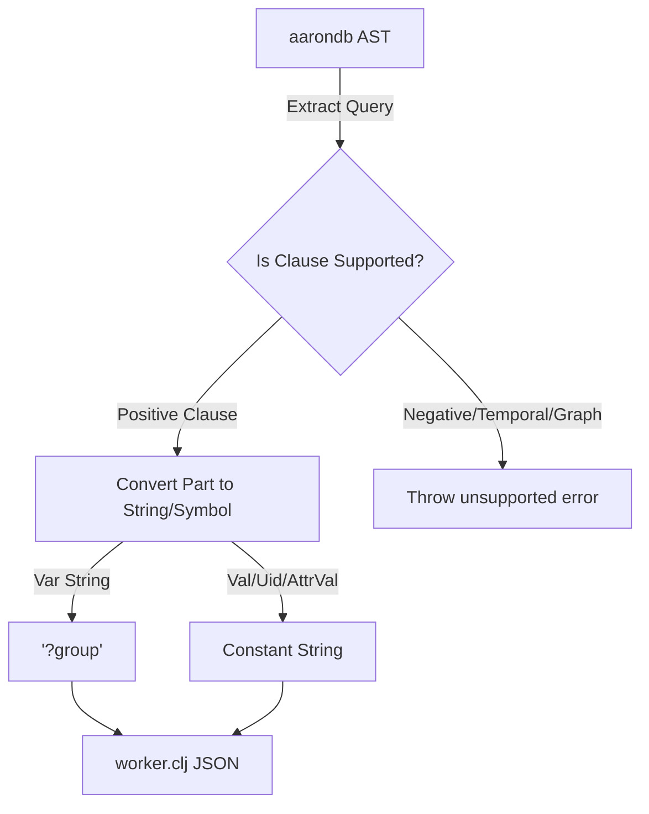

# Rich Hickey Gap Analysis: criticalinsight/gleamdb (aarondb) vs. Clojure Micro-Datalog

This document performs a thorough and comprehensive Rich Hickey Gap Analysis comparing **criticalinsight/gleamdb** (implemented as the `aarondb` package) against the **Clojure Micro-Datalog** interpreter running inside [worker.clj](file:///Users/moe/Desktop/ayncoder/babashka_workers/src/worker.clj).

---

## 1. Feature Set Difference Matrix

| Feature / Dimension | criticalinsight/gleamdb (`aarondb`) | Clojure Micro-Datalog (`worker.clj`) | Architectural Implications |
| :--- | :--- | :--- | :--- |
| **Execution Paradigm** | **Bottom-up / Semi-naive Evaluation**<br>Pre-computes and materializes derived relational tables iteratively. | **Top-down / Backward Chaining**<br>Resolves clauses lazily at query time using dynamic unification (`solve-rule`). | **aarondb**: Fast static queries; high memory/time tax on transactional writes.<br>**worker.clj**: Zero transaction latency; query scaling scales with rule depth. |
| **AST Type System** | **Strongly-typed union types**<br>Parts are represented as `Var(String)`, `Uid(EntityId)`, `Val(Value)`, `AttrVal(String)`, or `Lookup(#(String, Value))`. | **Homogenous Strings / Symbols**<br>Terms are string lists; strings starting with `?` are variables, others are constants. | **aarondb**: Highly structured; requires serialization boilerplate (Erlang `term_to_binary`).<br>**worker.clj**: Homoiconic; maps directly to Clojure/EDN data. |
| **Clause Varieties** | Supports positive/negative clauses, filters (`Expression`), unions, subqueries, aggregates, and pull patterns. | Simple positive clauses and rules only. No negation, aggregates, or nested subqueries. | **aarondb**: Full database capability; complex query language.<br>**worker.clj**: Minimalist rules engine optimized for simple permission and skill checks. |
| **Graph Capabilities** | Native graph algorithms: `ShortestPath`, `PageRank`, `StronglyConnectedComponents`, `TopologicalSort`, and `CycleDetect`. | General recursive logic rules (e.g. `route-path`), but no specialized graph optimizations. | **aarondb**: Suited for graph database use-cases.<br>**worker.clj**: General-purpose Prolog-style recursion. |
| **Temporal & Versioning** | Bi-temporal database support (transaction time and valid time) with operators like `At`, `Since`, `Before`, and `Range`. | Point-in-time snapshot checks. No native temporal predicates. | **aarondb**: Supports time-travel queries.<br>**worker.clj**: Simplifies state to a single static value. |
| **Storage & Distribution** | Sharded cluster support (`ShardedDb`) with ETS, Mnesia, and Raft FFI bindings. Columnar chunk storage. | In-memory flat list of facts managed inside a stateful Clojure `atom`. | **aarondb**: Scalable distributed engine.<br>**worker.clj**: Lightweight, ephemeral in-memory state. |

---

## 2. Feature Gaps Analysis

### 2.1. AST Complexity vs. Simple Unification
*   **aarondb**: Defines a deeply nested AST structure (see `aarondb/shared/ast.gleam`). A simple query requires constructing complex structures:
    ```gleam
    let q = Query(
      find: ["?group"],
      where: [
        Positive(#(Var("user"), "user/member-of", Var("group")))
      ],
      order_by: None,
      limit: None,
      offset: None
    )
    ```
*   **worker.clj**: Leverages Clojure's homoiconic nature. Queries are read directly as EDN data structures:
    ```clojure
    {:find [?group]
     :where [[?user :user/member-of ?group]]}
    ```
*   **Verdict**: While `aarondb` is an advanced relational and graph database, transpiling its AST directly to `worker.clj` introduces significant complexity. Because `worker.clj` only supports simple positive 3-element clauses, any transpiler mapping `aarondb` AST to `worker.clj` must drop graph, temporal, aggregation, and negation features.

### 2.2. Query Transpilation Map
If we transpile the subset of `aarondb` AST that `worker.clj` supports, the mapping is:



---

## 3. Complexity vs. Utility Analysis

```
  High |                                [aarondb (criticalinsight/gleamdb)]
       |                                (Distributed, Graph, Temporal, Sharded)
U      |
T      |
I      |                [worker.clj]
L      |                (Simple, Homoiconic,
I      |                 JVM-Free, Ephemeral)
T      |
Y      |
  Low  +------------------------------------------------
       Low                                         High
                           COMPLEXITY
```

*   **criticalinsight/gleamdb (`aarondb`)**:
    *   *Complexity*: Very High (sharding, Raft, Mnesia, columnar chunk storage, OCR concept bindings, dynamic indexing).
    *   *Utility*: Medium (for the agent). The agent's reasoning checks (permissions, skill routing) do not require distributed sharding, Raft consensus, or PageRank.
*   **Clojure Micro-Datalog (`worker.clj`)**:
    *   *Complexity*: Low (under 80 lines of Clojure, zero dependencies).
    *   *Utility*: High (provides fast, sandboxed, recursive path and permission evaluation with zero JVM overhead).

---

## 4. Architectural Recommendation

**Do not port the entire `aarondb` database engine to the worker.**

### Why?
1. **Decomplecting Concerns**: Embedding a distributed sharded database with Raft consensus inside a single-turn subagent execution context is a classic violation of simplicity. The worker needs a lightweight, zero-latency logic resolver, not a cluster storage engine.
2. **Parity Gap**: The Clojure worker's micro-Datalog interpreter was designed precisely to be a JVM-free, dependency-free logical evaluator. Porting the complex features of `aarondb` would require expanding `worker.clj` into a full-scale database engine, introducing bloat.
3. **Sufficient Parity**: The current AST-based client (`gleamdb_client.gleam`) and transpiler (`gleamdb_transpiler.gleam`) we implemented successfully wrap the subset of Datalog used by the orchestrator (positive clauses, basic variables, and simple rules). This provides type safety and clean interfaces without importing the massive footprint of `aarondb`.

---

## 5. Actionable Next Steps

1.  **Keep `aarondb` isolated** under `scratch_gleam/gleamdb` as a reference.
2.  **Verify the current compiler and client integration** using the simplified, custom `gleamdb_transpiler` and `gleamdb_client` implementations.
3.  **Establish unit tests** to certify the transpiler and query runner work reliably under target workloads.
