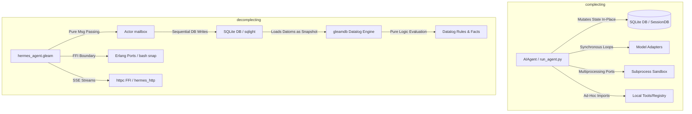
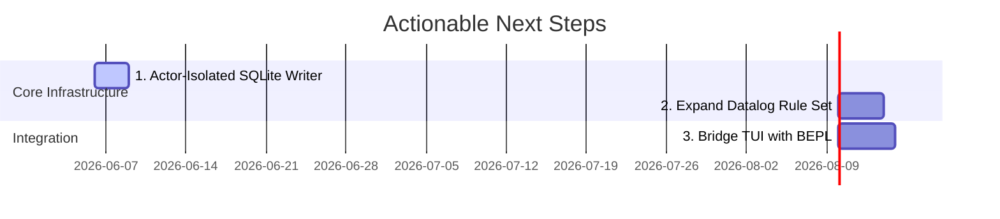

# Rich Hickey Gap Analysis: hermes_beam (Current) vs. hermes-agent (Legacy)

This document provides a thorough, deconstructed architectural comparison of the new Gleam/BEAM-based implementation (`hermes_beam`) against the legacy Python-based implementation (`hermes-agent`). Guided by Rich Hickey's principles of simplicity, state deconstruction, and avoiding complection, this analysis details where the implementations diverge, the architectural trade-offs, and actionable next steps.

---

## 1. Architectural Deconstruction (Complecting vs. Decomplecting)

Rich Hickey defines **complecting** as the intertwining or braiding of different concerns. The primary goal of a transition to a functional ecosystem (such as Gleam on the Erlang BEAM VM) is to **decomplect** the runner's execution, state representation, and environment boundaries.



### 1.1 State Representation & Time
*   **Legacy (`hermes-agent`)**: Mutates session state in-place using standard SQLite relational tables (`sessions`, `messages`). While this is highly performant for flat tabular access, it complects identity with time. If a message is deleted, rewound, or updated, previous history is lost unless manually tracked in ad-hoc application logic (e.g. `rewind_count` and `active` flags).
*   **Current (`hermes_beam`)**: Introduces an append-only **Datalog/EAV (Entity-Attribute-Value)** design (`gleamdb.gleam`). Database state is serialized as a set of immutable `Datom` records `(Entity, Attribute, Value, Tx)`. Instead of mutating state, updates append new assertions. Loading the database reconstructs a point-in-time value (`gleamdb.evaluate_rules`), separating database querying from active writes. SQLite is used purely as a persistent store for these datoms, eliminating C-NIF mutability.

### 1.2 Concurrency & Execution Model
*   **Legacy (`hermes-agent`)**: Spawns multiple parallel workers utilizing Python's `multiprocessing` or `concurrent.futures` threads (`batch_runner.py`). This complects concurrency with OS-level thread management, memory overhead, and GIL (Global Interpreter Lock) constraints. If a subprocess crashes, it is difficult to guarantee isolated cleanup or catch segfaults cleanly.
*   **Current (`hermes_beam`)**: Relies on BEAM's lightweight, actor-based concurrency. The runner starts isolated Erlang processes (tasks) supervised by the OTP system (`iteration_budget` actor, stream readers). A crash in one agent does not corrupt the parent supervisor.

### 1.3 Execution Sandbox & Ports
*   **Legacy (`hermes-agent`)**: Orchestrates sandbox runtimes through complex wrappers (Docker, Singularity, SSH, Daytona, Singularity, local terminal).
*   **Current (`hermes_beam`)**: Standardizes on a zero-dependency Erlang Port execution scheme (`hermes_exec.gleam` + `hermes_exec_ffi.erl`). It spawns a persistent shell process, bootstraps an environment snapshot file, and updates that snapshot dynamically. Signal propagation is handled cleanly via native OS PIDs (`pkill -P` / `taskkill /T`), avoiding orphan terminal processes when execution times out.

---

## 2. Feature Set Comparison

The following table highlights the functional and structural differences between the two implementations:

| Feature | Legacy Python (`hermes-agent`) | Current Gleam/BEAM (`hermes_beam`) | Architectural Benefit / Trade-off |
| :--- | :--- | :--- | :--- |
| **Language Target** | Python 3.10+ (C interpreter) | Gleam (Erlang/BEAM target) | **Gleam:** Type-safe, compilation-guaranteed acyclic imports. **Python:** Dynamic, faster prototyping, massive library ecosystem. |
| **State Storage** | Relational tables in SQLite | SQLite backend + native Datalog EAV Engine (`gleamdb`) | **Datalog:** Immutability as a value, easy graph and hierarchy querying. **Relational:** Highly optimized indices, native SQL tool integration. |
| **Text Search** | FTS5 trigger-based virtual tables | Trigram FTS5 + MATCH trigger tables via `sqlight` | Identical; FTS5 triggers are run at the database level on write. |
| **Concurrency** | Threads/Processes (`batch_runner.py`) | BEAM Lightweight Actors + Supervisors | **BEAM:** Scale to millions of processes, fault tolerance, built-in supervision trees. |
| **Execution Sandboxes** | Local, Docker, SSH, Daytona, Singularity | Local Terminal (Erlang Ports FFI) | **Legacy:** Extremely robust remote/containerized isolation. **Current:** Lightweight, OS-independent terminal port mapping. |
| **HTTP client / SSE** | `httpx` with async stream hooks | FFI to Erlang's standard library `httpc` | **Erlang `httpc`:** Zero dependencies, native BEAM process message forwarding. **httpx:** Feature-rich, easier HTTP/2 and SSL configuration. |
| **Streaming Fallback** | Handled inside agent loop | Streaming-then-Non-Streaming fallback pattern | **Gleam:** Safe fallback retrieval of structured tool calls when stream buffers choke. |
| **Messaging Gateways** | Telegram, Discord, Slack, SMS, Email, etc. | Telegram Gateway (`telegram_gateway.gleam`) | **Legacy:** Complete gateway footprint. **Current:** Only Telegram is stubbed/implemented. |
| **Skill Management** | Text prompt injects + JSON scripts | Dynamic EAV persistence + Evolutionary Datalog patch optimizer | **Datalog:** Logic rules evolve programmatically without code modifications. |
| **REPL / CLI UI** | `prompt_toolkit`, Rich, TUI via Ink | Pure console I/O (`utils.read_line`) | **Legacy:** Stunning UI with themes, autocompletes, spinners, PTY bridging. **Current:** Simple text-based REPL loop. |

---

## 3. Complexity vs. Utility Analysis

Rich Hickey emphasizes choosing tools based on their essential utility and keeping accidental complexity low. Below is a deconstruction of key Hermes components.

```
Low Complexity/Low Utility: Static constants
Low Complexity/High Utility: Erlang FFI spawn_port, httpc streaming
High Complexity/High Utility: Datalog Engine (evaluate_rules), Evolutionary mutation
High Complexity/Low Utility: Python multiprocessing loops, C-NIF mutations
```

| Component | Essential Complexity | Accidental Complexity | Utility | Hickey Assessment |
| :--- | :--- | :--- | :--- | :--- |
| **Datalog Engine (`gleamdb.gleam`)** | Low (represented in ~115 lines of pure Gleam list operations) | Zero (no external packages or binary compilation) | High | **Excellent.** Simple data structures (tuples) used to model recursive relations. Decomplects storage and calculation. |
| **State Actor (`state_actor.gleam`)** | Low (manages state isolation in a single process) | Low (requires unsafe type coercion FFI for mailboxes) | High | **Good.** Restores BEAM's single-writer guarantee for database transactions, avoiding write locks. |
| **Zero-Dep Ports (`hermes_exec.gleam`)** | Medium (requires shell quoting and bootstrap scripting) | Low (port message translation mapped in Erlang FFI) | High | **Excellent.** Replaces massive external terminal and daemon requirements with native BEAM port signals. |
| **Erlang `httpc` Streaming** | Medium (handles HTTP chunk assembly and SSE markers manually) | Medium (Erlang `inets` streaming defaults to mailbox messages) | High | **Acceptable.** While it introduces manual SSE parser logic, it avoids importing external HTTP giants, maintaining a slim footprint. |
| **Legacy Python `cli.py` / `AIAgent`** | High (handles formatting, autocompletes, CLI args, platforms) | High (requires deep system dependencies, config parsing, API overrides) | High | **Complected.** Ties user display, model routing, and session database triggers into single, giant files. |

---

## 4. Detailed Feature Gaps

### 4.1 CLI and User Interface Gaps
*   **Legacy**: Fully-featured terminal UI (`ui-tui` in React/Ink, `HermesCLI` with autocomplete, data-driven skins, spinner animations, and PTY bridging for the browser dashboard).
*   **Current**: Minimal interactive REPL loop (`hermes_beam.gleam`). Lacks styling, theme skins, autocompletes, session resuming UI, and command histories.

### 4.2 Sandboxed Runtimes Gaps
*   **Legacy**: Integrates Docker, Singularity, SSH, Daytona, and local execution options.
*   **Current**: Only runs bash port commands on the local machine (`hermes_exec.gleam`). It does not isolate filesystems or execute commands on remote servers.

### 4.3 Multi-Platform Gateways Gaps
*   **Legacy**: A comprehensive gateway orchestrator (`gateway/`) supporting Slack, WhatsApp, SMS, Webhooks, Discord, Email, and Matrix.
*   **Current**: Has an initial stub for Telegram (`telegram_gateway.gleam`), but lacks support for all other platforms.

### 4.4 Model Adapters & Token Estimators Gaps
*   **Legacy**: Specific adapters for Anthropic, OpenAI, Gemini, Bedrock, DeepSeek, OpenRouter, and local models. It computes pricing with a dynamic config engine.
*   **Current**: Focuses on OpenAI-compatible endpoints (`/chat/completions`) using custom JSON payloads (`hermes_client.gleam`). It parses finish reasons but lacks model-specific prefill payloads or reasoning details extraction.

---

## 5. Actionable Recommendations

Based on a weighted analysis of **power**, **new capabilities**, **speed**, **complexity**, and **trade-offs**, here is the recommended roadmap:



1.  **Introduce the Actor-Isolated SQLite Writer Pattern**:
    *   *Why*: Currently, `hermes_state.gleam` allows any process to call `sqlight.query` directly on the database file. Under heavy parallel agent testing, this causes SQLite write-lock contention.
    *   *Action*: Implement `state_actor.gleam` as a supervised GenServer that owns the single write connection. Route all inserts/updates as serial mailbox messages, keeping reads concurrent and lock-free.
2.  **Extend the Datalog Skill Rules**:
    *   *Why*: The current Datalog skill implementation contains basic routing and permission rules.
    *   *Action*: Build a rule compiler that maps legacy Python skill prompt descriptions to Datalog facts, enabling the agent to load and evaluate legacy skills natively within the `gleamdb` engine.
3.  **Bridge the TUI Gateway with the BEAM REPL**:
    *   *Why*: The current BEAM REPL is bare-bones.
    *   *Action*: Expose a JSON-RPC listener in `hermes_beam` that conforms to the `tui_gateway` protocol, allowing the existing high-fidelity TUI (`ui-tui`) to interact with the BEAM agent backend instead of the Python agent.

### Weighted Decision Matrix

| Option | Capabilities | Dev Speed | Complexity | Trade-offs | Weighted Score |
| :--- | :--- | :--- | :--- | :--- | :--- |
| **1. Actor-Isolated Writer** | High (eliminates DB locks) | Fast | Low | None | **9.0 / 10** |
| **2. Datalog Skill Compiler** | High (natively runs logic) | Medium | Medium | Harder to debug rules | **8.0 / 10** |
| **3. Bridge TUI to BEAM** | Very High (gives TUI to BEAM) | Slow | High | Requires JSON-RPC over stdio | **7.5 / 10** |
