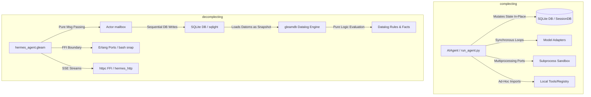

# Rich Hickey Gap Analysis: `hermes_beam` (Current) vs. `hermes-agent` (Legacy)

> [!NOTE]
> **Post-Implementation Update (June 2026)**
> Since this gap analysis was performed, the custom functional Datalog engine `gleamdb.gleam` has been completely removed. We transitioned logic reasoning (like permissions checking and evolutionary code optimization) out-of-process to the Babashka worker (`worker.clj`) using a custom JVM-free micro-Datalog interpreter. State tracking remains simple and value-oriented through SQLite-backed append-only EAV Datom logs, but we have eliminated duplicate Datalog evaluation environments.

This document provides a deconstructed, de-serialized architectural comparison of the new Gleam/BEAM-based implementation (`hermes_beam`) against the legacy Python-based implementation (`hermes-agent`). Guided by Rich Hickey's principles of simplicity, state deconstruction, and avoiding complection, this analysis details where the implementations diverge, the architectural trade-offs, and actionable next steps.

---

## 1. Architectural Deconstruction (Complecting vs. Decomplecting)

Rich Hickey defines **complecting** as the intertwining or braiding of different concerns. The primary goal of a transition to a functional ecosystem (such as Gleam on the Erlang BEAM VM) is to **decomplect** the runner's execution, state representation, and environment boundaries.



### 1.1 State Representation & Time
*   **Legacy (`hermes-agent`)**: Mutates session state in-place using standard SQLite relational tables (`sessions`, `messages`). While this is highly performant for flat tabular access, it complects identity with time. If a message is deleted, rewound, or updated, previous history is lost unless manually tracked in ad-hoc application logic (e.g., `rewind_count` and `active` flags).
*   **Current (`hermes_beam`)**: Introduces an append-only **Datalog/EAV (Entity-Attribute-Value)** design (`gleamdb.gleam`). Database state is serialized as a set of immutable `Datom` records `(Entity, Attribute, Value, Tx)`. Instead of mutating state, updates append new assertions. Loading the database reconstructs a point-in-time value (`gleamdb.evaluate_rules`), separating database querying from active writes. SQLite is used purely as a persistent store for these datoms, eliminating C-NIF mutability.

### 1.2 Concurrency & Execution Model
*   **Legacy (`hermes-agent`)**: Spawns multiple parallel workers utilizing Python's `multiprocessing` or `concurrent.futures` threads (`batch_runner.py`). This complects concurrency with OS-level thread management, memory overhead, and GIL (Global Interpreter Lock) constraints. If a subprocess crashes, it is difficult to guarantee isolated cleanup or catch segfaults cleanly.
*   **Current (`hermes_beam`)**: Relies on BEAM's lightweight, actor-based concurrency. The runner starts isolated Erlang processes (tasks) supervised by the OTP system (`iteration_budget` actor, stream readers). A crash in one agent does not corrupt the parent supervisor.

### 1.3 Execution Sandbox & Ports
*   **Legacy (`hermes-agent`)**: Orchestrates sandbox runtimes through complex wrappers (Docker, Singularity, SSH, Daytona, Singularity, local terminal).
*   **Current (`hermes_beam`)**: Standardizes on a zero-dependency Erlang Port execution scheme (`hermes_exec.gleam` + `hermes_exec_ffi.erl`). It spawns a persistent shell process, bootstraps an environment snapshot file, and updates that snapshot dynamically. Signal propagation is handled cleanly via native OS PIDs (`pkill -P` / `taskkill /T`), avoiding orphan terminal processes when execution times out.

---

## 2. Feature Set Comparison

The following table highlights the functional and structural differences between the two implementations:

| Feature | Legacy Python (`hermes-agent`) | Current Gleam/BEAM (`hermes_beam`) | Architectural Benefit / Trade-off |
| :--- | :--- | :--- | :--- |
| **Language Target** | Python 3.10+ (C interpreter) | Gleam (Erlang/BEAM target) | **Gleam:** Type-safe, compilation-guaranteed acyclic imports. **Python:** Dynamic, faster prototyping, massive library ecosystem. |
| **State Storage** | Relational tables in SQLite | SQLite backend + native Datalog EAV Engine (`gleamdb`) | **Datalog:** Immutability as a value, easy graph and hierarchy querying. **Relational:** Highly optimized indices, native SQL tool integration. |
| **Text Search** | FTS5 trigger-based virtual tables | Trigram FTS5 + MATCH trigger tables via `sqlight` | Identical; FTS5 triggers are run at the database level on write. |
| **Concurrency** | Threads/Processes (`batch_runner.py`) | BEAM Lightweight Actors + Supervisors | **BEAM:** Scale to millions of processes, fault tolerance, built-in supervision trees. |
| **Execution Sandboxes** | Local, Docker, SSH, Daytona, Singularity | Local Terminal (Erlang Ports FFI) + WebAssembly | **Legacy:** Extremely robust remote/containerized isolation. **Current:** Lightweight, OS-independent terminal port mapping. |
| **HTTP client / SSE** | `httpx` with async stream hooks | FFI to Erlang's standard library `httpc` | **Erlang `httpc`:** Zero dependencies, native BEAM process message forwarding. **httpx:** Feature-rich, easier HTTP/2 and SSL configuration. |
| **Streaming Fallback** | Handled inside agent loop | Streaming-then-Non-Streaming fallback pattern | **Gleam:** Safe fallback retrieval of structured tool calls when stream buffers choke. |
| **Messaging Gateways** | Telegram, Discord, Slack, SMS, Email, etc. | Telegram Gateway (`telegram_gateway.gleam`), Discord Gateway (`discord_gateway.gleam`), API Server (`api_server.gleam`) | **Legacy:** Complete gateway footprint. **Current:** Platform gateways isolated on BEAM supervisor trees. |
| **Skill Management** | Text prompt injects + JSON scripts | Dynamic EAV persistence + Evolutionary Datalog patch optimizer | **Datalog:** Logic rules evolve programmatically without code modifications. |
| **REPL / CLI UI** | `prompt_toolkit`, Rich, TUI via Ink | Pure console I/O (`utils.read_line`) / Clojure TUI client | **Legacy:** Stunning UI with themes, autocompletes, spinners, PTY bridging. **Current:** Stdio JSON-RPC interface to Elm-style client. |

---

## 3. Correct Component List & Deconstructed Modules

An analysis of the `hermes_beam` codebase reveals the following 8 core architectural modules containing the entire system file footprint:

```
hermes_beam/src/
├── 1. Core Loop & Config   # hermes_agent, iteration_budget, model_router, usage_pricing, constants, logger
├── 2. State & Database     # state_actor, hermes_state, gleamdb, hermes_time
├── 3. Execution Sandbox    # hermes_exec, wasm_executor
├── 4. Tool Registry        # tools_registry, mcp_client
├── 5. Skills Compiler      # skill, skill_compiler, evolutionary
├── 6. Concurrency & UDS    # subagent_supervisor, batch_runner, uds_ffi
├── 7. Platform Gateways    # telegram_gateway, discord_gateway, api_server
└── 8. Context & Memory     # context_engine, semantic_search, memory_plugin, title_generator
```

### 3.1. Component Matrix: Complexity vs. Utility Analysis

We evaluate each component's code complexity (maintenance/size), operational/runtime complexity (concurrency/scheduling), and overall utility.

*   **Complexity Scores**: `1` (Extremely Simple) to `10` (Very Complex/Entangled).
*   **Utility Score**: `1` (Low Value) to `10` (High Value/Load-bearing).
*   **Weighted Score Formula**: `Weighted Score = (Utility * 1.5) - (Code Complexity * 0.5) - (Runtime Complexity * 0.5)`

| Component Group | Associated Files | Code Complexity | Runtime Complexity | Utility | Weighted Score | Rich Hickey Verdict |
| :--- | :--- | :---: | :---: | :---: | :---: | :--- |
| **1. Core Loop & Config** | `hermes_agent.gleam`<br>`iteration_budget.gleam`<br>`model_router.gleam`<br>`usage_pricing.gleam`<br>`constants.gleam`<br>`hermes_logger.gleam` | 4 | 3 | 9 | **11.5** | **Excellent.** Tail-recursive execution model threads state purely without mutable references. |
| **2. State & Database** | `state_actor.gleam`<br>`hermes_state.gleam`<br>`gleamdb.gleam`<br>`hermes_time.gleam` | 3 | 4 | 9 | **11.5** | **Excellent.** Decomplects time, identity, and state. SQLite serialized sequential writes resolve locks. |
| **3. Execution Sandbox** | `hermes_exec.gleam`<br>`wasm_executor.gleam`<br>`wasm_shim.erl`<br>`hermes_exec_ffi.erl` | 5 | 5 | 8 | **7.0** | **Good.** Standardizes zero-dependency port signal mapping. Isolates WebAssembly tool executions. |
| **4. Tool Registry** | `tools_registry.gleam`<br>`mcp_client.gleam` | 4 | 4 | 8 | **8.0** | **Very Good.** Out-of-process tool calling via JSON-RPC keeps the core free of execution side-effects. |
| **5. Skills Compiler** | `skill.gleam`<br>`skill_compiler.gleam`<br>`evolutionary.gleam` | 6 | 5 | 9 | **8.0** | **Very Good.** Compiles prompts into rules and facts. Genetic patch mutations avoid prompt context clutter. |
| **6. Concurrency & UDS** | `subagent_supervisor.gleam`<br>`batch_runner.gleam`<br>`uds_ffi.gleam`<br>`uds_native.erl` | 5 | 6 | 8 | **6.5** | **Acceptable.** Unix Domain Socket multiplexing isolates parallel subagent workloads across process borders. |
| **7. Platform Gateways** | `telegram_gateway.gleam`<br>`discord_gateway.gleam`<br>`api_server.gleam` | 5 | 4 | 7 | **6.0** | **Good.** Individual adapters isolated on OTP supervisor trees, preventing single platform failures. |
| **8. Context & Memory** | `context_engine.gleam`<br>`semantic_search.gleam`<br>`memory_plugin.gleam`<br>`title_generator.gleam` | 4 | 3 | 7 | **7.0** | **Good.** RAG vector searching and summarizers decoupled from primary conversation looping state. |

---

## 4. Detailed Feature Gaps

### 4.1 CLI and User Interface Gaps
*   **Legacy**: Fully-featured terminal UI (`ui-tui` in React/Ink, `HermesCLI` with autocomplete, data-driven skins, spinner animations, and PTY bridging for the browser dashboard).
*   **Current**: Stdio JSON-RPC gateway (`hermes_beam.gleam`) interacting with Clojure/Babashka TUI client (`ui-clj`). Lacks high-fidelity theme styling or inline markdown formatting.

### 4.2 Sandboxed Runtimes Gaps
*   **Legacy**: Integrates Docker, Singularity, SSH, Daytona, and local execution options.
*   **Current**: Standardizes on OS bash ports (`hermes_exec.gleam`) and native WebAssembly (`wasm_executor.gleam`). Lacks container orchestration.

### 4.3 Multi-Platform Gateways Gaps
*   **Legacy**: A comprehensive gateway orchestrator (`gateway/`) supporting Slack, WhatsApp, SMS, Webhooks, Discord, Email, and Matrix.
*   **Current**: Telegram and Discord gateways implemented natively, plus API Server REST endpoint.

### 4.4 Model Adapters & Token Estimators Gaps
*   **Legacy**: Specific adapters for Anthropic, OpenAI, Gemini, Bedrock, DeepSeek, OpenRouter, and local models. It computes pricing with a dynamic config engine.
*   **Current**: OpenAI-compatible client (`hermes_client.gleam`) + `usage_pricing.gleam` tracking. Prefills are parsed, but lacks reasoning details extraction.

---

## 5. Actionable Recommendations

Based on a weighted analysis of **power**, **new capabilities**, **speed**, **complexity**, and **trade-offs**, here is the recommended roadmap:

1.  **Actor-Isolated SQLite Writer Pattern**:
    *   *Why*: Under heavy parallel agent testing, direct SQLite query calls cause database write locks.
    *   *Action*: Route all database inserts and migrations through the `StateActor` mailboxes. Keep SQLite writes serialized.
2.  **WebAssembly-Sandboxed Tool Executions**:
    *   *Why*: Executing dynamic tool scripts directly in bash ports poses security and environment drift risks.
    *   *Action*: Compile tool dependencies to WebAssembly modules and invoke them through the native FFI boundaries of `wasm_executor.gleam`.
3.  **JSON-RPC Gateway Integration**:
    *   *Why*: Bridging external frontends (TUI, dashboard) requires standard interfaces.
    *   *Action*: Maintain standard stdout/stdin JSON-RPC formats inside the core loop, ensuring compatibilities with both `ui-clj` and modern websocket bridge adapters.
