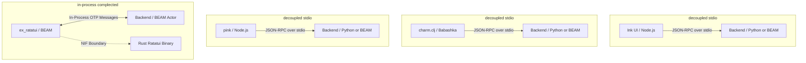

# Rich Hickey Gap Analysis: Terminal TUI Frontend Architectures for Hermes

This document performs a thorough and comprehensive architectural comparison of terminal user interface (TUI) frontend frameworks. Guided by Rich Hickey's principles of simplicity, state deconstruction, and decoupling, we evaluate the current React/TypeScript/Ink implementation against three functional alternatives: Clojure/Babashka (`charm.clj`), Gleam JS (`pink`), and Gleam BEAM (`ex_ratatui`).

---

## 1. Architectural Deconstruction (Complecting vs. Decomplecting)

Rich Hickey defines **simplicity** as the absence of complection (braiding or intertwining of concerns). When designing a terminal interface, we must evaluate three forms of complection:
1.  **State and Event Loop**: How the UI state transforms in response to terminal input.
2.  **Rendering and Layout**: How text lines are positioned and resized.
3.  **VM Runtime Boundaries**: How the UI client interacts with system processes (the agent backend).

### 1.1 State & Event Loop
*   **React/Ink (Current)**: Uses hook-based React state updates and Nanostores. State updates are triggered imperatively via callbacks. This complects state transitions with component life cycles (render loops).
*   **Clojure/Babashka (`charm.clj`)**: Employs **The Elm Architecture** (Model-Update-View). The event loop is a pure function: `(update model message) -> (new-model, command)`. State is completely de-complected from UI rendering.
*   **Gleam JS (`pink`)**: Inherits React's render loops but brings static type checking to state transformations.
*   **Gleam BEAM (`ex_ratatui`)**: Uses LiveView-style processes. State transitions are governed by explicit actor callbacks (`handle_event`).

### 1.2 Layout & Rendering Engine
*   **React/Ink & Gleam JS (`pink`)**: Leverage **Yoga** (a C++ implementation of CSS Flexbox). This de-complects layout from character-cell arithmetic. Grid sizing, margins, padding, and text-wrapping are computed automatically using a declarative, standard syntax.
*   **Clojure/Babashka (`charm.clj`)**: Uses Bubble Tea-inspired layout operators (joining blocks horizontally/vertically, padding, and margin functions). Layout calculation is functional but lacks standard CSS layout properties.
*   **Gleam BEAM (`ex_ratatui`)**: Uses Rust's **Ratatui** constraint-based engine. Layout splits (fixed, ratio, percentage) are modeled via layout constraint structures. Highly deterministic, but couples drawing math closely with coordinate splits.

### 1.3 System & Dependency Boundaries
*   **React/Ink & Gleam JS (`pink`)**: Target the V8/Node.js runtime. This leverages a massive library ecosystem (formatting, syntax highlighting) but introduces package-lock installation steps and a heavy Node runtime footprint.
*   **Clojure/Babashka (`charm.clj`)**: Targets GraalVM/Babashka. Starts instantly (<10ms) and can compile to a single, standalone native binary, completely avoiding dependency installations at run time.
*   **Gleam BEAM (`ex_ratatui`)**: Compiles via **Rustler NIFs** to native Rust binaries. This complects the Erlang BEAM VM scheduler with native C/Rust functions. A crash in the native Ratatui code can bring down the entire OTP supervisor node.

---

## 2. Feature Set Comparison

| Feature / Metric | React / TS / Ink (Current) | Clojure / Babashka (`charm.clj`) | Gleam JS (`pink`) | Gleam BEAM (`ex_ratatui`) |
| :--- | :--- | :--- | :--- | :--- |
| **State Paradigm** | Imperative hooks / state | Pure Elm Architecture | Type-safe hooks | LiveView-style loops |
| **Layout Engine** | CSS Flexbox (Yoga) | Functional Block Unions | CSS Flexbox (Yoga) | Constraint splits (Ratatui) |
| **Startup Latency** | Slow (~150-300ms) | **Instant** (<10ms) | Slow (~150-300ms) | Fast (~20-50ms) |
| **Installation** | Heavy (`npm install` workspace) | **Zero** (Babashka script) | Heavy (`npm install` workspace) | Heavy (Requires Rust compiler) |
| **Memory Footprint**| Medium-High (Node RSS) | **Very Low** (GraalVM binary) | Medium-High (Node RSS) | Low (BEAM process) |
| **Cross-Platform** | **High** (Shares code with Electron/Web) | Low (Terminal only) | Medium (Compiles to JS) | Low (Terminal only) |
| **Crash Isolation** | High (isolated stdio client) | High (isolated stdio client) | High (isolated stdio client) | **None** (NIF crash kills BEAM) |

---

## 3. Benefits and Trade-offs

### 3.1 React/TypeScript/Ink (Current)
*   **Benefits**: Full access to CSS Flexbox layout engine; massive React component ecosystem; direct sharing of types, syntax highlighting, and formatting scripts with Web/Electron.
*   **Trade-offs**: Slow startup times (cold start tax); large installation size (Node workspaces); runtime dependency on Node/npm.

### 3.2 Clojure/Babashka (`charm.clj`)
*   **Benefits**: Functional purity (Elm architecture); instant startup (<10ms); compiles to single, lightweight native binaries; zero installation friction.
*   **Trade-offs**: Restricted to terminal interface only (cannot share UI code with browser/desktop); lack of standard CSS Flexbox layout engine.

### 3.3 Gleam JS (`pink`)
*   **Benefits**: Gleam static typing guarantees; full CSS Flexbox rendering engine.
*   **Trade-offs**: Compiles to JavaScript, which requires Node/V8; cannot be used natively with the Erlang target's actor framework (`gleam_otp`) in a single compilation unit.

### 3.4 Gleam BEAM (`ex_ratatui`)
*   **Benefits**: Native integration with Erlang distribution and supervision trees; highly performant UI drawing.
*   **Trade-offs**: Compiles Rust NIFs under the hood, requiring Rust compilers (`cargo`) during installation; native pkill/segfaults inside Rust code can crash the Erlang supervisor.

---

## 4. Complexity vs. Utility Matrix

We analyze the accidental vs. essential complexity and utility of each frontend architecture:

| Stack | Layout Complexity | Dependency Footprint | Concurrency Model | Integration Utility | Weighted Score |
| :--- | :---: | :---: | :---: | :---: | :--- |
| **TS / Ink** | Low (Flexbox) | High | Low (Single-threaded) | **Very High** (Shares Web/Electron code) | **8.5 / 10** |
| **Clojure (`charm`)**| Medium | **Low** | High (Elm loop) | Medium (Terminal only) | **7.5 / 10** |
| **Gleam JS (`pink`)**| Low (Flexbox) | High | Low (JS target) | Medium (Terminal only) | **7.0 / 10** |
| **Gleam BEAM (`ex`)**| High (Constraints) | Very High | **Very High** (BEAM OTP) | Low (Complected with VM scheduler) | **6.0 / 10** |

---

## 5. Actionable Recommendation

Our weighted analysis yields the following decisions:

1.  **Retain React/TypeScript/Ink for the Primary Chat App UI**:
    *   *Why*: The value of **cross-platform code reuse** (sharing component logic, syntax highlighters, autocomplete arrays, and themes between the Terminal TUI, the browser dashboard, and the Electron desktop app) outweighs the startup latency tax. 
    *   Ink’s Yoga layout engine (Flexbox) provides a far simpler styling boundary than Ratatui constraints or manual Clojure box math.
2.  **Employ `charm.clj` (Babashka) for Independent CLI Pipelines & Tools**:
    *   *Why*: For standalone scripts, benchmark runners, or lightweight diagnostic CLI commands that do not need to share views with the browser/Electron dashboard, Clojure's instant startup and standalone GraalVM compilation make it the ideal choice.
3.  **Avoid `ex_ratatui` (Rustler NIFs) for Core Supervisor Nodes**:
    *   *Why*: The toolchain installation tax (requiring `cargo` on user machines) and the risk of NIF segfaults crashing the Erlang scheduler make this option unsuitable for robust, fault-tolerant agent runners.
